# Описание тестовых случаев

- [**Тестирование создания пространственных индексов на плоскости - LineSpatialIndexes2DTests**](#Header1);
  - [**SimpleIndexes2DTest**](#SimpleIndexes2DTest);
  - [**LeftOrRightIntersectIndexes2DTest**](#LeftOrRightIntersectIndexes2DTest);
  - [**NotIntersectVerticalLinesIndexes2DTest**](#NotIntersectVerticalLinesIndexes2DTest);
  - [**LineInCellIndexes2DTest**](#LineInCellIndexes2DTest);
  - [**SegmentinCellIndexes2DTest**](#SegmentinCellIndexes2DTest);
  - [**ComplexIndexes2DTest**](#ComplexIndexes2DTest);
  - [**PointOnGridIndexes2DTest**](#PointOnGridIndexes2DTest);
  - [**PointOnCrossbreedIndexes2DTest**](#PointOnCrossbreedIndexes2DTest);
- [**Тестирование создания пространственных индексов в трёхмерном пространстве - LineSpatialIndexes3DTests**](#Header2);
  - [**SimpleIndexes3DTest**](#SimpleIndexes3DTest);
  - [**IntersectIndexes3DTest**](#IntersectIndexes3DTest);
- [**Тестирование построения индекса для значений лежащих в отрицательной зоне - NegativeIndexTests**](#Header3);
  - [**NegativeIndexPositiveOriginTest2D**](#NegativeIndexPositiveOriginTest2D);
  - [**NegativeIndexPositiveOriginTest3D**](#NegativeIndexPositiveOriginTest3D);
  - [**NegativeIndexNegativeOriginTest2D**](#NegativeIndexNegativeOriginTest2D);
  - [**NegativeIndexNegativeOriginTest3D**](#NegativeIndexNegativeOriginTest3D);
  
##  Тестирование создания пространственных индексов на плоскости

Класс **LineSpatialIndexes2DTests**.

###  SimpleIndexes2DTest

Простой тест для линии возрастающей по осям OX и OY (по OX интенсивнее, по OY в границах одной строки). 
Тест должен показать что оно вообще работает, и что не появляется избыточных записей.

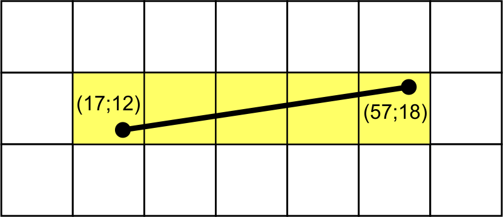 

###  LeftOrRightIntersectIndexes2DTest

Тест на построение индекса линии, которая пересечёт некоторые ячейки пространственной сетки либо только слева, либо, наоборот, только справа.
Тест должен показать что ячейки попадают в индекс независимо от того, как их пересекает линия.

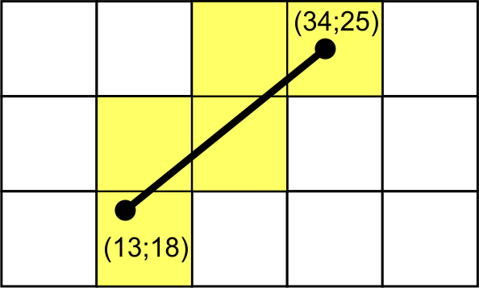 

###  NotIntersectVerticalLinesIndexes2DTest

Тест на построение индекса линии, которая рассматривается по оси OX, однако не имеет для начальной и конечной ячейки пересечения с её вертикальными границами (характерно для концов отрезка).
Тест должен показать, что ячейки попадут в индекс, даже если отсутствует пересечение с границей сетки.

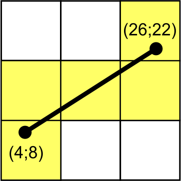 

###  LineInCellIndexes2DTest

Тест на построение индекса линии, которая полностью умещается в одной единственной ячейке пространственного индекса.
Тест должен показать что эта ячейка попала в индекс.

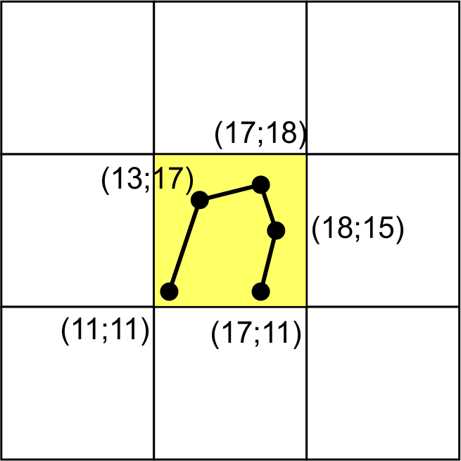 

###  SegmentinCellIndexes2DTest

Тест на построение индекса, когда промежуточный участок не имеет пересчений с сеткой пространственного индекса.
Тест должен показать что такие участки не выпадают из индекса.

 

###  ComplexIndexes2DTest

Тестирование построения индекса линии, в которой встречаются все возможные направления линий.
Тест должен показать что пространственный индекс работает как для возрастающих по X или Y линий, так и для убывающих во всех комбинациях.

- Возрастает по OY интенсивнее, чем убывает по OX.

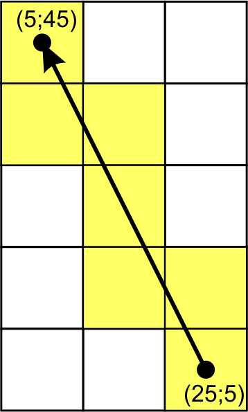 

- Возрастает по OY, не изменяется по OX.

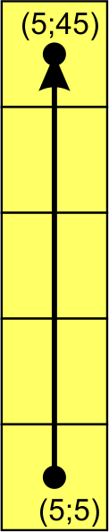 

- Возрастает по OY интенсивнее, чем возрастает по OX.

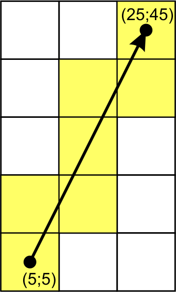 

- Убывает по OY интенсивнее, чем убывает по OX.

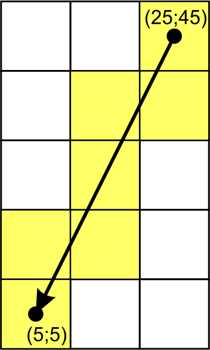 

- Убывает по OY, не изменяется по OX.

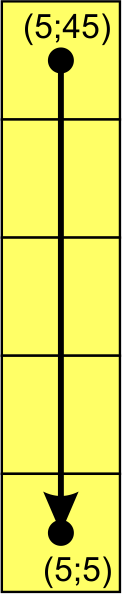 

- Убывает по OY интенсивнее, чем возрастает по OX.

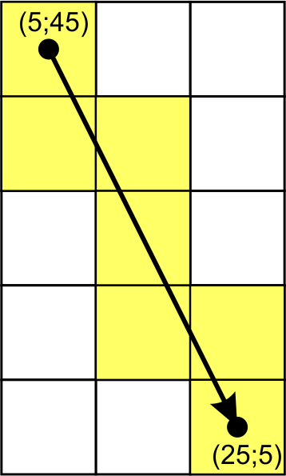 

- Возрастает по OX интенсивнее, чем возрастает по OY.

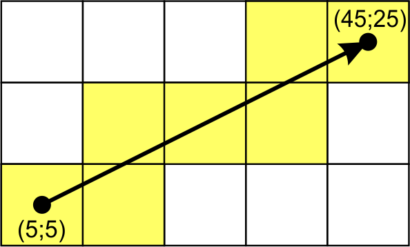 

- Возрастает по OX, не изменяется по OY.

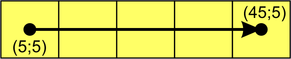 

- Возрастает по OX интенсивнее, чем убывает по OY.

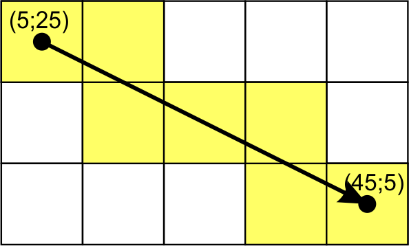 

- Убывает по OX интенсивнее, чем возрастает по OY.

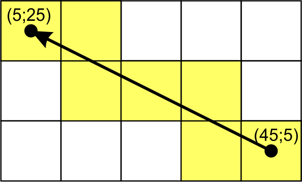 

- Убывает по OX, не изменяется по OY.

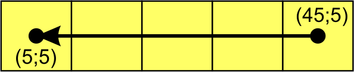 

- Убывает по OX интенсивнее, чем убывает по OY.

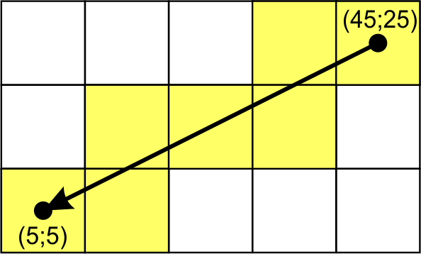 

###  PointOnGridIndexes2DTest

Тестирование построения индекса линии, когда граничные точки которой, лежат прямо на сетке пространственного индекса.
Тест должен показать что все смежные ячейки попали в индекс. 

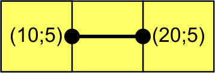 

###  PointOnCrossbreedIndexes2DTest

Тестирование построения индекса линии, когда граничные точки которой, лежат на пересечении линий сетки пространственного индекса.

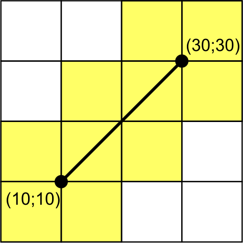 

##  Тестирование создания пространственных индексов в трёхмерном пространстве

Класс **LineSpatialIndexes3DTests**.

###  SimpleIndexes3DTest

Простой тест на построение пространственного индекса.
Тест должен показать что оно вообще работает, и что не появляется избыточных записей.

###  IntersectIndexes3DTest

Тест на то, как строится индекс, если наибольшее изменение происходит по оси OX, однако, начальная точка расположена так, что первое перечечение происходит с плоскостью параллельной OXZ (вместо OYZ, как в идеальном случае).
Тест должен показать что ничего не выпадает из индекса, при соединении проекций.

##  Тестирование построения индекса для значений лежащих в отрицательной зоне

Класс **NegativeIndexTests**.

###  NegativeIndexPositiveOriginTest2D

Тест на построение индекса для значений меньше чем начало координат.
Координаты как положительные так и отрицательные.
Начало системы координта положительное число.

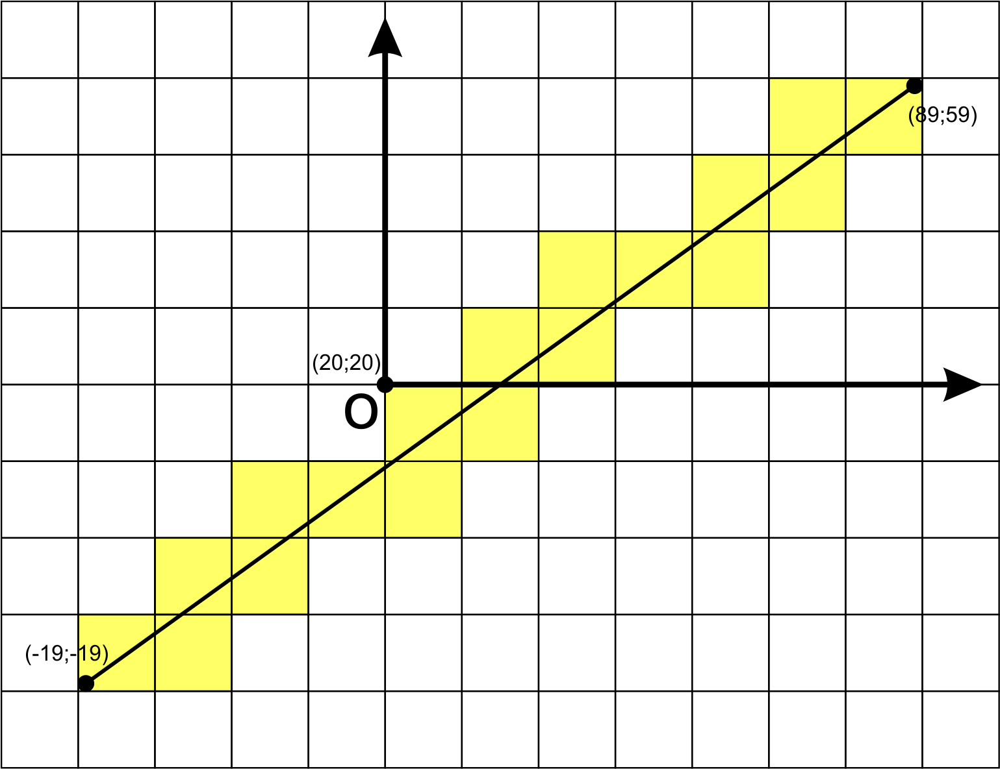 

###  NegativeIndexPositiveOriginTest3D

Тест на построение индекса для значений меньше чем начало координат в 3D пространстве.
Координаты как положительные так и отрицательные.  
Начало системы координта положительное число.

###  NegativeIndexNegativeOriginTest2D

Тест на построение индекса для значений меньше чем начало координат.
Координаты как положительные так и отрицательные.  
Начало системы координта отрицательное число.

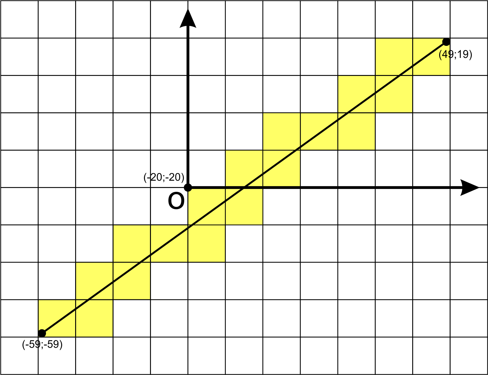 

###  NegativeIndexNegativeOriginTest3D

Тест на построение индекса для значений меньше чем начало координат в 3D пространстве.
Координаты как положительные так и отрицательные.  
Начало системы координта отрицательное число.
